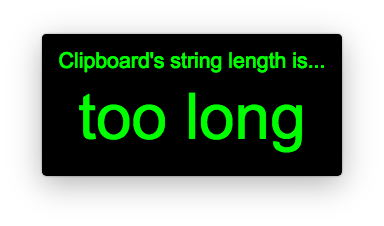

LCC is a Lightweigt Character Counter based on [Electron](http://electron.atom.io).

# Platform

Mac/Windows

# Binaries

Download the latest [LCC release](https://github.com/cotrpepe/LCC/releases)

# How to use LCC

## Launch LCC

Double-click the LCC.app (Mac) or LCC.exe (Windows)

## Calculate String Length

Copy a string to the clipboard

## Close LCC

### Menu (Mac only)

'LCC' menu -> 'Quit' submenu

### Tray Icon

Tray Icon -> 'Quit' menu

### Shortcut

Command+Q (Mac) or Ctrl+Q (Windows)

# Limitation

The max character length is 99,999,999.

# Build from Source Code

## Install

1. Install [node.js](https://nodejs.org)
2. Download ZIP or clone the repository
3. `$ npm install` to install npm packages

## Run

`$ npm start`

## Test

`$ npm test`

## Build binaries

`$ npm run package`

# License

MIT
